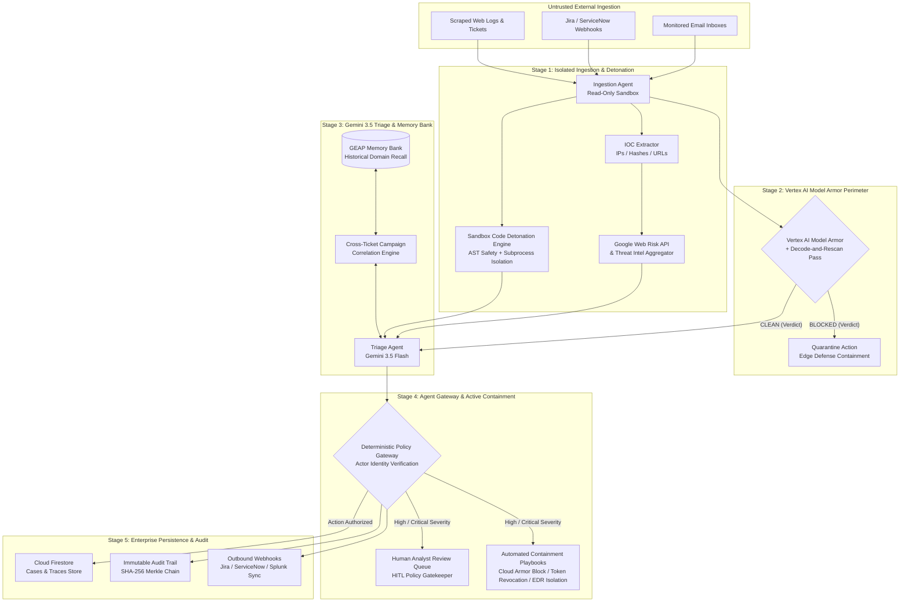

# Enterprise System Design & Architecture Specification — SOC Analyst Agent

**Project:** SOC Analyst Agent — Zero-Trust Security Pipeline  
**GCP Project Name:** `SOC Analyst Agent` (Project ID: `newproject-464521`)  
**Target Architecture:** Fortified Enterprise Fleet  
**Cloud Infrastructure:** Google Cloud Platform (`us-central1` / `global`)  
**Live Endpoint URL:** [https://soc-analyst-agent-ek2ft62bza-uc.a.run.app](https://soc-analyst-agent-ek2ft62bza-uc.a.run.app)  
**Core Technologies:** Vertex AI Model Armor, Gemini 3.5 Flash, GEAP Memory Bank, Google Cloud Web Risk API, Cloud Firestore, Cloud Run, OpenTelemetry

---

## 1. Executive Summary & Architecture Overview

Enterprise Security Operations Centers (SOCs) process thousands of untrusted inputs daily (support tickets, customer emails, web log streams, SIEM alerts). When autonomous AI agents process this raw data, they expose the enterprise to high-risk AI attack vectors:
- **Direct & Indirect Prompt Injections**
- **Jailbreak System Prompt Overrides**
- **Base64 / Hexadecimal / URL-encoding Obfuscation Evasions**
- **Multi-Stage Cross-Ticket Campaigns (Low-and-Slow Multi-Turn Attacks)**
- **Malicious C2 Link & Credential Exfiltration Attempts**

The **SOC Analyst Agent** establishes a zero-trust, defense-in-depth pipeline that isolates untrusted inputs, detonates suspicious scripts in a **Sandbox Environment**, screens payloads at the edge using **Vertex AI Model Armor**, enriches context with **Google Cloud Web Risk API** and **GEAP Memory Bank**, triages alerts with **Gemini 3.5 Flash**, executes **Automated Containment & Host Isolation Playbooks**, signs every decision with an **Immutable SHA-256 Cryptographic Audit Certificate**, and enforces deterministic action control behind a single **Agent Gateway Policy Choke Point**.




---

## 2. Pipeline Subsystems & Data Flow

### Stage 1: Ingestion Isolation & Threat Intel Subsystem
* **Read-Only Posture:** Upstream ingestion agents operate under strict read-only execution constraints with zero write-capable tools.
* **IOC Extractor:** Automatically extracts IPv4 addresses, MD5/SHA256 file hashes, and URLs using optimized regular expressions.
* **Google Cloud Web Risk API:** Query `webrisk.googleapis.com` for real-time URL classification (`MALWARE`, `SOCIAL_ENGINEERING`, `UNWANTED_SOFTWARE`).
* **Threat Intel Lookup:** Cross-references extracted IPs and hashes against threat databases (AbuseIPDB, VirusTotal, Local Threat Cache) to compute an aggregated risk score (0–100).

### Stage 2: Vertex AI Model Armor Edge Perimeter
* **Inline Screening:** Screens input text against GCP Vertex AI Model Armor templates (`soc-analyst-armor-template`) for Prompt Injection, Jailbreak attempts, Tool Poisoning, and PII leaks.
* **Pre-Screening Decode-and-Rescan Engine:** Obfuscated attacks wrap payloads inside Base64, Hexadecimal, or URL-encoded blobs. `BaseModelArmor.screen()` detects encoded candidates, safely decodes printable strings, and re-screens them through Model Armor. If any decoded candidate or literal text trips a filter, the case is instantly **QUARANTINED** at the edge.

### Stage 3: Gemini 3.5 Triage & GEAP Memory Bank
* **Domain-Scoped Context Recall:** Queries the **Gemini Enterprise Agent Platform (GEAP) Memory Bank** using subject key index `subject_key = sender_domain`.
* **Multi-Stage Campaign Correlation Engine:** Attackers split prompt injections across separate tickets (Ticket 1: System prompt override directive $\rightarrow$ Ticket 2: Credential dump command). Gemini 3.5 Flash analyzes current ticket content against recalled Memory Bank history, identifying cross-ticket campaign patterns and escalating severity to `CRITICAL` (`multi-stage-campaign`).

### Stage 4: Agent Gateway Policy Choke Point
* **Identity Authority:** `gateway.py` enforces a single choke point for external mutations.
* **Action Authorization:** Only authorized actions (`escalate`, `close`, `notify`, `quarantine`) are executed.
* **Human-in-the-Loop (HITL) Gatekeeper:** Elevated threats or escalated cases trigger a mandatory Human Analyst Review banner in the UI with `Approve Escalation`, `Force Quarantine`, or `Dismiss` options.

### Stage 5: Compliance & Enterprise Integrations
* **Cryptographic Audit Trail (SOC 2 / ISO 27001):** Every processed case receives a SHA-256 Merkle chain audit certificate:
  $$\text{Certificate Hash}_n = \text{SHA256}(\text{Hash}_{n-1} + \text{Case ID} + \text{Verdict} + \text{Actor Identity} + \text{Timestamp})$$
* **Inbound SIEM / ITSM Sync:** Webhook endpoints (`/api/v1/webhooks/jira`, `/api/v1/webhooks/servicenow`, `/api/v1/webhooks/{source}`) parse analyst comments and state changes, reconciling status in Firestore.

---

## 3. Data Schema Specifications

### Case Model (`cases/{caseId}`)
```json
{
  "case_id": "case_3b4d9794e173",
  "status": "triaged",
  "synthetic": false,
  "source": {
    "channel": "ticket",
    "sender": "vendor-updates@supplyco-notifications.com",
    "received_at": "2026-08-31T06:59:15.102Z"
  },
  "raw_content_ref": "raw_39b5ef0a4c7a",
  "model_armor_result": {
    "verdict": "clean",
    "threat_type": null,
    "confidence": 0.0,
    "screened_at": "2026-08-31T06:59:16.012Z"
  },
  "threat_intel": {
    "has_threats": false,
    "ips_found": [],
    "hashes_found": [],
    "urls_found": [],
    "risk_score_max": 0,
    "formatted_summary": "No malicious technical IOCs detected."
  },
  "triage": {
    "severity": "critical",
    "category": "multi-stage-campaign",
    "reasoning": "Obfuscated payload attempting override correlated with prior domain context.",
    "similar_past_cases": ["case_102a4b889c01"],
    "llm_used": true
  },
  "action_taken": {
    "type": "escalated",
    "actor_agent_identity": "action-agent",
    "executed_at": "2026-08-31T06:59:42.310Z"
  },
  "audit_certificate": {
    "case_id": "case_3b4d9794e173",
    "certificate_id": "cert_9d33a50a9fe0",
    "timestamp": "2026-08-31T06:59:43.001Z",
    "merkle_root_hash": "933e63a7896f067f5231c8901b02...",
    "previous_block_hash": "00000000000000000000000000000000...",
    "outcome": "actioned",
    "actor_identity": "soc-agent-gateway-v1",
    "signature": "sha256:7b92a104f...",
    "verified": true
  },
  "webhook_history": []
}
```

---

## 4. Security & Compliance Controls

| Domain | Control Description | Enforcement Mechanism |
| :--- | :--- | :--- |
| **Edge Defense** | Vertex AI Model Armor Inline Filter | Screen prompts against Prompt Injection, Jailbreak, Tool Poisoning, and PII leaks. |
| **Evasion Mitigation** | Pre-Screening Decode-and-Rescan | Extract & decode Base64, Hex, URL-encoded candidates prior to screening. |
| **URL Threat Defense** | Google Cloud Web Risk API | Screen URLs against Google's global malware/phishing database (`webrisk.googleapis.com`). |
| **Multi-Stage Defense**| Cross-Ticket Vector Clustering | GEAP Memory Bank domain context recall correlates Ticket $N$ with Ticket $N-1$. |
| **Action Authority** | Gateway Policy Choke Point | Single choke point for tool invocation with identity verification (`gateway.py`). |
| **Compliance Audit** | Merkle Hash-Chain Audit Certificate | SHA-256 signed audit block per incident for SOC 2 / ISO 27001 legal auditing. |
